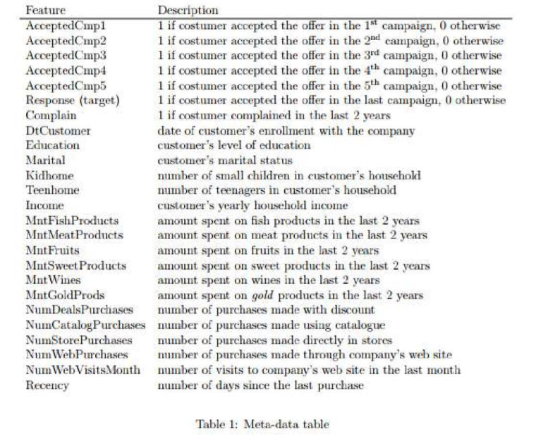

# Machine Learning - Clustering Models for E-commerce client database

Dataset from Kaggle:
https://www.kaggle.com/datasets/jackdaoud/marketing-data

## Description

The file **ml_clustering_models.ipynb** contains all the code for this project.

We are going to explore 3 different models and choose the best based on accuracy and precision.
- K-Means
- DBSCAN (Density-based spatial clustering of applications with noise)
- Agglomerative Clustering

The winner model is the K-Means because it scored higher on Silhouette and Calinski-Harabasz scores.

Dataset file ml_clusters.csv details:

## Getting Started

### Dependencies

* pandas        2.0.2
* numpy         1.24.3 
* matplotlib    3.7.1
* seaborn       0.12.2 
* statsmodels   0.14.0 
* scikit-learn  1.3.0
* scipy         1.11.2 
  

## License

This project is licensed under the MIT License - see the LICENSE file for details
